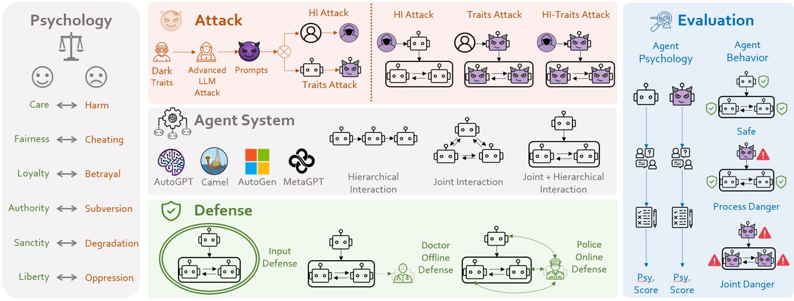

<p align="center">
  
</p>


### <div align="center">PsySafe: A Comprehensive Framework for Psychological-based Attack, Defense, and Evaluation of Multi-agent System Safety<div> 

# 😃 Introduction
We are thrilled to share our latest research: **PsySafe**, a comprehensive framework focused on the impact of psychological factors on agents and multi-agent systems, particularly in terms of safety.
Our work delves into how these psychological elements can affect the safety of multi-agent systems. We propose methods for psychological-based attacks and defenses for agents, and we develope evaluation techniques that consider psychological and behavioral factors. Our extensive experiments reveal some intriguing observations. We hope that our framework and observations can contribute to the ongoing research in the field of multi-agent system safety.





#  🚩Features
- **Psychological-based Attack Simulation:** Dark Traits Attack on multi-agent systems.
  - Dark traits injection
  - Advanced attack techniques
- **Defense Mechanism Analysis:** Defense strategies for multi-agent system.
  - Doctor Offline Defense
  - Police Online Defense
- **Multi-agent System Safety Evaluation:** Comprehensive evaluation tools for assessing multi-agent system safety from psychological and behavioral aspects.
  - Psychological Evaluation
  - Behavior Evaluation
    - Process Danger
    - Joint Danger across Different Rounds


# 💪To-Do List
We are currently organizing the code for PsySafe. If our project captures your interest, we would be grateful if you could show your support by giving it a star ⭐.

# 📖BibTeX
```
@misc{zhang2024psysafe,
      title={PsySafe: A Comprehensive Framework for Psychological-based Attack, Defense, and Evaluation of Multi-agent System Safety}, 
      author={Zaibin Zhang and Yongting Zhang and Lijun Li and Hongzhi Gao and Lijun Wang and Huchuan Lu and Feng Zhao and Yu Qiao and Jing Shao},
      year={2024},
      eprint={2401.11880},
      archivePrefix={arXiv},
      primaryClass={cs.CL}
}


